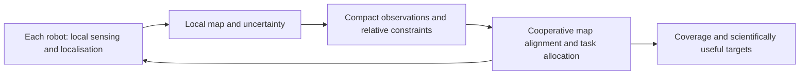

# Connecting Underwater Localisation and Swarm Coordination

**Research concept, consolidated 9 October 2026. No integrated AUV, aerial swarm or cooperative SLAM system has been implemented in this project.**

## Motivation

My destination study led me to think about exploration beyond a single surface rover. I have considered whether robust localisation methods studied for autonomous underwater vehicles could be combined with coordination principles studied for drone swarms. The proposed connection is between capabilities: reliable local navigation and cooperative decision-making.

This does not assume that aerial hardware, radio links, flight dynamics or terrestrial underwater sensor models can be transplanted to Europa. For a hypothetical Europa ocean mission, access through the ice, energy, pressure, uncertain ocean properties, communication through the ice and contamination control remain unresolved mission-level problems. Drone-swarm coordination is a source of algorithmic ideas, not a proposal to fly ordinary drones on Europa.

## A possible layered architecture

The working hypothesis is that robots could retain independent local navigation while exchanging selected information to improve collective coverage. Communication would improve performance, while essential safety and basic navigation would remain local.

## Questions I would test

1. **Localisation uncertainty:** how do degraded observations affect drift, and how should uncertainty be represented to other robots?
2. **Map alignment:** how can two local maps be linked without assuming perfect shared coordinates or accepting an incorrect inter-robot loop closure?
3. **Communication budget:** can keyframe descriptors, relative constraints and target summaries provide useful collaboration with much less data than full point clouds?
4. **Disconnection:** what should a robot do when communication is delayed or lost, and how should it rejoin the team?
5. **Scientific priorities:** can task allocation improve useful coverage while respecting energy and navigation risk?

## A realistic progression from the current work

The completed RGB-D benchmark is a first step in learning geometry and local mapping. Before attempting multi-robot autonomy, I would evaluate a single robot under controlled visual degradation and report failures. A small terrestrial or analogue simulation could then compare one and two agents, with explicit bandwidth and disconnection conditions.

Possible measurements include trajectory error, map-alignment error, correctly verified shared loop closures, coverage, message volume and task completion. These are proposed measurements, not results already obtained. An aerial coordination method and an underwater localisation method would need their own reading notes, sensor assumptions and evaluation before a specific fusion method could be justified.

## Relationship to the science background

NASA's [Europa overview](https://science.nasa.gov/jupiter/jupiter-moons/europa/) and [Europa Clipper mission](https://science.nasa.gov/mission/europa-clipper/) motivate the ocean-world question but do not validate this proposed architecture. The architecture and test questions above are my exploratory interpretation. No affiliation with a laboratory, investigator, NASA or ESA is implied.
