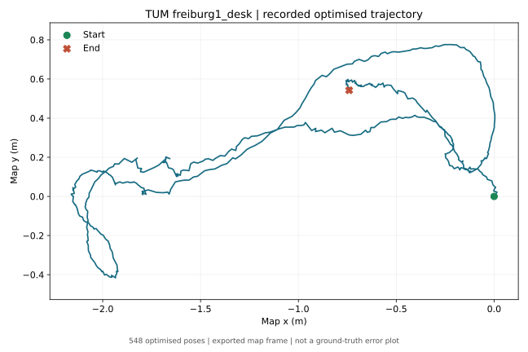
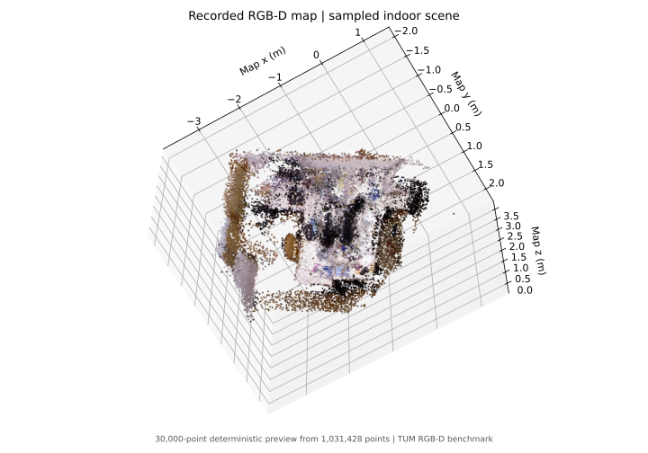

# Recorded RGB-D SLAM Experiment

## Scope and provenance

Run: `A4-20260930-desk-full-03`, generated 30 September 2026. Input: the indoor TUM `freiburg1_desk` sequence. Publication figures were rendered from saved output files on 9 October 2026; no new full ROS replay was run for this portfolio.

| Recorded item | Value |
|---|---:|
| Associated RGB-D pairs | 573 |
| Odometry poses | 573 |
| Optimised poses / database nodes | 548 |
| Exported coloured map points | 1,031,428 |
| Unique global loop-closure constraints | 124 |
| Global constraints spanning at least 30 node IDs | 19 |
| Odometry-only aligned absolute position error RMSE | 0.097661 m |
| Optimised aligned absolute position error RMSE | 0.025180 m |

The errors are copied from the [recorded evo evaluation](../evidence/evaluation.txt), not recalculated for the portfolio. `evo_ape` 1.37.1 used rigid SE(3) Umeyama alignment, without scale fitting. The two trajectories have different pose counts, so the values are descriptive results rather than a controlled matched-frame ablation or a justified percentage improvement. This is a single indoor sequence, not a robustness benchmark.

## System

`Associated RGB-D + camera intrinsics → rgbd_odometry → RTAB-Map loop closure / pose graph → exported trajectory and map`

The depth conversion uses `depth_png / 5000` to obtain metres, then publishes ROS `32FC1`. The chosen ROS-default intrinsics are stored in [the camera configuration](../configs/tum_freiburg1.json). The [SLAM configuration](../configs/a4_rtabmap.yaml) leaves ground-truth frames empty.

The [subscription snapshot](../evidence/node_subscriptions.txt) and replay source document the ground-truth separation. Ground truth is read by evaluation only after the estimation processes stop.

## Inspectable evidence

- [Odometry trajectory](../evidence/odometry_estimate.tum)
- [Optimised trajectory](../evidence/slam_poses.txt)
- [Loop-closure audit](../evidence/loop_closures.json)
- [Replay counts](../evidence/replay_summary.json)
- [Evaluation](../evidence/evaluation.txt)
- [Detailed original A4 notes](../docs/a4_slam.md)

The audit records 248 directed global-closure rows, equivalent to 124 unique undirected global constraints. The large original RTAB-Map database and full PLY map remain local. Their absence means the public subset supports inspection of the saved audit and trajectories, but does not independently rerun the database audit until the pipeline is reproduced.

## Figures

This plot uses the saved optimised trajectory in its exported map frame. It does not show alignment against ground truth and is not an error plot. All coordinate axes are in metres.

This is a deterministic subsample of up to 30,000 coloured points from the final 1,031,428-point map. It is an indoor scene reconstructed from TUM data, not an icy-world simulation. [Figure metadata](../evidence/figure-provenance.json) records source hashes and sampling details. Re-render with `python scripts/render_portfolio_figures.py --map PATH_TO_SAVED_SLAM_CLOUD`.

## Limitations and next experiment

The result uses an existing framework, a short indoor dataset and recorded RGB-D images. There is no deployment on a robot and no Mars/Europa, underwater or multi-agent validation. Next, compare matched timestamps, calculate RPE and vary texture/depth loss under controlled conditions before attempting broader claims.
